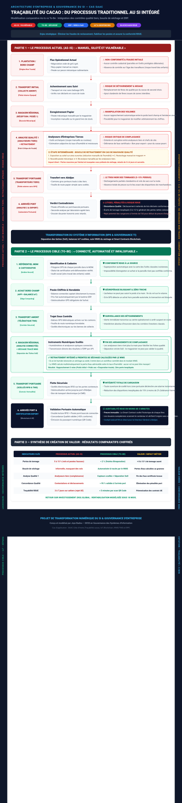

# 🌾 De la Plantation au Port : Traçabilité Numérique et Gouvernance de la Chaîne du Cacao (Cas SAAC)

> Projet de Modernisation des Systèmes d'Information, Architecture d'Entreprise et Gestion des Risques  
> Comment transformer une chaîne d'approvisionnement agro-industrielle manuelle et opaque en un écosystème numérique infalsifiable conforme aux normes internationales (Règlement Européen sur la Déforestation - RDUE).

---

## 📌 Table des Matières
1. Sommaire Exécutif & Cadrage Métier
2. Diagnostic de la Situation Actuelle (As-Is) & Dysfonctionnements
3. Le Parcours Concret d'un Lot : Avant vs Après
4. Architecture Cible du Système d'Information (To-Be)
5. Rôle Pratique et Opérationnel des Outils Technologiques
6. Cadre de Gouvernance, Contrôle Interne & Cybersécurité
7. Indicateurs Clés de Performance (KPI / KRI) & Métriques Cibles
8. Méthodologie et Feuille de Route de Déploiement (18 Mois)
9. Création de Valeur Globale & Enseignements

---

## 1. Sommaire Exécutif & Cadrage Métier

### Le Métier de la SAAC
La Société Agricole d’Achat du Cacao (SAAC) est une entreprise privée de négoce international opérant en Côte d'Ivoire. Elle assure le rôle d'intermédiaire commercial et logistique entre des milliers de petits exploitants agricoles / coopératives locales et les grands négociants et chocolatiers mondiaux (Europe, Amérique du Nord). L'entreprise s'organise autour d'un siège central à Abidjan et de quatre filiales régionales situées au cœur des bassins de production.

### La Problématique d'Affaires
Historiquement, la totalité de la chaîne d'approvisionnement (achats en bord champ, chargement, pesées intermédiaires, tests d'humidité, stockage et transport portuaire) reposait sur des processus manuels et des registres papier. Cette absence de visibilité numérique engendrait trois menaces majeures :
* Pertes financières massives : Entre l'achat en brousse et l'embarquement portuaire, 5 à 15 % du tonnage disparaissait chaque année (vols, détournements de cargaisons, erreurs de pesée mécanique et freintes non contrôlées).
* Discordance et fraude sur la qualité : Des lots déclarés de premier choix en magasin régional arrivaient déclassés au port après mélange clandestin ou altération, causant des litiges et des pénalités financières.
* Risque réglementaire existentiel : L'Union Européenne a mis en application le Règlement sur la Déforestation (RDUE), interdisant l'importation de cacao cultivé sur des terres déboisées après 2020 ou lié au travail des enfants. Incapable de prouver l'origine parcellaire de ses fèves, la SAAC risquait l'embargo total et la faillite.

### La Réponse Stratégique
La solution conçue ne se limite pas à informatiser des cahiers existants ; elle orchestre une Refonte des Processus d'Affaires (BPR) complète. Elle déploie un système d'information intégré reliant des balances connectées (IoT), un suivi de flotte par géorepérage (GPS/Geofencing), une dorsale de gestion unifiée (ERP / SCM), un référentiel de données maîtres (MDM) et un registre immuable de certification (Blockchain).

---

## 2. Diagnostic de la Situation Actuelle (As-Is) & Dysfonctionnements

**Flux Actuel Détaillé :**
* **Étape 1 (Plantation / Bord champ) :** Négociation orale de gré à gré en brousse. Aucun contrôle de l'origine cadastrale (risque d'intrusion en forêts classées protégées) ni vérification de l'âge de la main-d'œuvre (risque de travail des enfants).
* **Étape 2 (Transport initial amont) :** Transport en vrac sans suivi ni feuille de route balisée. Arrêts non tracés favorisant les chargements pirates ou les substitutions de sacs.
* **Étape 3 (Magasin régional / Réception) :** Pesée mécanique artisanale sur peson manuel à ressort. Enregistrement vulnérable sur cahiers et registres papier avec écriture manuscrite.
* **Étape 4 (Analyse Qualité 1 locale) :** Évaluation manuelle avec des outils archaïques confiée à des analyseurs issus d'entreprises tierces, générant un risque critique de complaisance ou de corruption locale.  
  * *Boucle intermédiaire de retraitement (en cas de non-conformité) :* Si le lot présente une humidité excessive ou des défauts, il subit un traitement manuel (étalage et séchage prolongé au soleil sur aires ouvertes). Cette étape engendre des manipulations répétées : pertes de matière par évaporation/vol, restockage, nouvelle pesée mécanique et ré-analyse manuelle, créant une source majeure d'écarts de stocks inexpliqués.
* **Étape 5 (Transport portuaire aval) :** Camions gros porteurs sous-traités à des transporteurs tiers, sans balise GPS ni scellés électroniques, exposant la cargaison à des déchargements partiels ou détournements en route.
* **Étape 6 (Arrivée au port d'Abidjan & Export) :** Analyse Qualité 2 contradictoire effectuée par un laboratoire portuaire tiers. Révélation fréquente d'écarts majeurs de tonnage (5 à 15 %) et de déclassements qualitatifs par rapport aux constats du magasin régional, provoquant litiges, pénalités financières et retards d'embarquement.

**Dysfonctionnements majeurs :**
1. **Défaillance et opacité des données :** Multiplicité des saisies manuelles sur papier, registres non synchronisés et impossibilité de vérifier les antécédents d'un lot.
2. **Vulnérabilité aux arrangements locaux :** Recours à des analyseurs tiers sans traçabilité instrumentée et absence de séparation des tâches (**SoD**).
3. **Pertes cumulées lors des retraitements :** Le séchage au soleil et les pesées successives créent un « trou noir » logistique masquant les vols sous couvert de freinte naturelle.
4. **Risque de rejet международal (RDUE) :** Incapacité de certifier l'absence de déforestation et la légalité sociale dès le premier kilomètre.

---

## 3. Le Parcours Concret d'un Lot : Avant vs Après

| Étape du Flux | Processus Actuel (As-Is / Manuel) | Risques et Vulnérabilités | Processus Cible (To-Be / Numérique) | Contrôle et Sécurité Apportés |
| :--- | :--- | :--- | :--- | :--- |
| **1. Enregistrement de la Plantation** | Déclaration orale de gré à gré, aucun relevé géographique formel. | Achat de cacao cultivé illégalement dans des forêts classées protégées ou recourant au travail des enfants. | Cartographie GPS de la parcelle enregistrée dans le référentiel **MDM** (*Master Data Management*). | Vérification automatique d'exclusion des zones protégées par cadastre numérique (conformité stricte RDUE). |
| **2. Achat bord champ & Pesée initiale** | Peson mécanique à ressort, reçu écrit à la main au crayon sur carnet à souche. | Falsification du poids par l'acheteur, détournement de fèves, prix d'achat arbitraire non régulé. | Balance numérique connectée (**IoT / Edge**) et application mobile hors-ligne synchronisée. | Le poids est chiffré et horodaté dès la pesée ; aucun champ de poids n'est modifiable manuellement. |
| **3. Transport amont initial** | Chauffeur sans suivi d'itinéraire, chargement en vrac sans scellés ni feuille de route numérique. | Arrêts non déclarés, substitution de sacs par du cacao dégradé ou ajouts clandestins en cours de route. | Balise télématique GPS sur le camion avec géorepérage actif (**Geofencing**). | Alerte immédiate transmise au siège social si le véhicule dévie du corridor prévu ou marque un arrêt suspect. |
| **4. Réception magasin, Analyse 1 & Retraitement** | Évaluation manuelle avec outils archaïques par des analyseurs tiers (risque de complaisance). En cas de mauvaise qualité : étalage au soleil pour séchage, restockage, re-pesée mécanique et ré-analyse manuelles. | Corruption locale, faux certificats de conformité, pertes physiques de fèves lors des séchages successifs masquant des vols et amplifiant les écarts de stocks. | Analyseurs d'humidité électroniques connectés à l'application. Paramètres de séchage et freintes suivis en temps réel dans le module **WMS** avec séparation des tâches (**SoD**). | Rapprochement automatique 3 voies dans l'**ERP** (Poids IoT + Qualité + Identifiant Planteur). Données d'analyse scellées et inaltérables sans intervention humaine modifiable. |
| **5. Transport aval vers le Port** | Camions gros porteurs sous-traités à des tiers sans balise GPS ni scellés électroniques. Feuille de route papier simple. | Déchargements partiels clandestins en route, disparition de sacs, pertes de tonnage inexpliquées (5 à 15 %). | Boîtiers télématiques GPS avec géorepérage (**Geofencing**) et scellés électroniques RFID sur les bennes de transport. | Détection immédiate de tout arrêt suspect hors couloir logistique ou ouverture de benne non planifiée avec remontée d'alerte au siège. |
| **6. Arrivée au Port & Export International** | Seconde pesée et analyse contradictoire manuelle au port par laboratoire tiers sur bordereaux papier. | Litiges fréquents sur la qualité, déclassement inattendu de lots, lourdes pénalités financières et risque d'embargo douanier RDUE. | Double lecture RFID / pont-bascule portuaire intégrée à l'**ERP** et certification finale par **Blockchain (Smart Contract)**. | Tolérance d'écart de poids verrouillée à < 2 % (freinte naturelle). Émission d'un **QR Code** exportateur certifiant l'origine et la légalité en moins de 30 secondes. |
---

## 4. Architecture Cible du Système d'Information (To-Be)

L'architecture décloisonne les filiales régionales et le siège social à travers une structure en couches :

1. Couche Décision & Gouvernance : Tableaux de Bord Exécutifs (EIS/BI), alertes conformité RDUE en temps réel et suivi du risque résiduel.
2. Couche Dorsale Applicative (ERP Central) : Modules Finances, Achats, Chaîne Logistique (SCM), Gestion d'entrepôt et transport (WMS/TMS), et moteur transactionnel (STT/TPS).
3. Couche Collecte Terrain : Application mobile commerciale avec coordonnées GPS, balances connectées (IoT), boîtiers camions géorepérés.
4. Couche Confiance & Registre Distribué : Blockchain de traçabilité, contrats intelligents (Smart Contracts) rejetant automatiquement les lots non certifiés, et QR Codes pour les acheteurs internationaux.

---

## 5. Rôle Pratique et Opérationnel des Outils Technologiques

1. L'ERP / PGI (Progiciel de Gestion Intégré) :
Centralise les Achats, Stocks, Logistique et Comptabilité. Dès qu'un sac de cacao est scanné et pesé, l'ERP met à jour le stock disponible, calcule le paiement officiel, génère la liasse de transport et passe l'écriture comptable sans ressaisie.

2. Le Moteur Transactionnel (STT / TPS) :
Garantit le respect des propriétés ACID (Atomicité, Cohérence, Isolation, Durabilité). Si la connexion mobile coupe au milieu d'un enregistrement en brousse, la transaction n'est pas corrompue et se resynchronise dès le retour du réseau.

3. Les Balances Connectées (IoT & Edge Computing) :
Les balances capturent la masse, la signent numériquement et la transmettent par réseau mobile. L'opérateur ne peut pas modifier le chiffre sur son écran pour voler la différence de poids.

4. Le Géorepérage GPS (Geofencing) :
Le cadastre des forêts classées de Côte d'Ivoire est intégré dans l'application mobile. Si un commercial tente d'enregistrer un achat sur des coordonnées GPS situées dans un périmètre protégé, le système bloque la transaction.

5. La Gestion des Données Maîtres (MDM — Master Data Management) :
Crée le Golden Record (enregistrement unique et certifié) de chaque producteur. Empêche qu'un même planteur soit enregistré deux fois avec des identités ou des surfaces différentes.

6. La Blockchain & les Smart Contracts :
Registre distribué partagé entre la SAAC, les coopératives, les douanes et les clients exportateurs. Un Smart Contract rejette automatiquement le lot si l'audit social de conformité (zéro travail des enfants) a expiré.

7. La Business Intelligence (BI / EIS) :
Tableaux de bord visuels en temps réel pour la direction à Abidjan. Les dirigeants identifient les anomalies de tonnage par région, les niveaux de stock portuaire et l'état de conformité des commandes en cours d'embarquement.

---

## 6. Cadre de Gouvernance, Contrôle Interne & Cybersécurité

Organisation en Trois Lignes de Maîtrise :
* 1re Ligne (Opérations & Terrain) : Acheteurs, magasiniers et chauffeurs appliquant les contrôles obligatoires via l'application mobile et les balances connectées.
* 2e Ligne (Supervision & Conformité) : Le Responsable de la Sécurité des Systèmes d'Information (RSSI) et le Responsable Qualité surveillant les alertes de géorepérage et les écarts de stock.
* 3e Ligne (Assurance Indépendante) : Audit interne réalisant des pesées inopinées sur site pour vérifier la concordance exacte entre stock physique et stock numérique.

Séparation des Tâches (Segregation of Duties - SoD) :
* Le commercial terrain ne peut pas évaluer la qualité du produit.
* Le contrôleur qualité du magasin ne peut pas modifier la pesée issue de la balance IoT.
* Le chef de site régional ne peut pas ordonner le paiement bancaire sans le rapprochement automatique 3 voies (Pesée IoT + Analyse Qualité + Certificat GPS hors forêt classée).

Cybersécurité & Modèle Zero Trust (Alignement ISO/IEC 27001 & 27002) :
* Gestion des Identités (IAM & MFA) : Chaque employé dispose d'un compte individuel protégé par authentification multifacteur (MFA).
* Gestion des Comptes à Privilèges (PAM) : Les accès des administrateurs aux serveurs sont temporaires et journalisés de manière inaltérable.
* Chiffrement : Flux chiffrés en transit (mTLS / TLS 1.3) et bases de données chiffrées au repos (AES-256).

---

## 7. Indicateurs Clés de Performance (KPI / KRI) & Métriques Cibles

| Indicateur | Typologie | Définition & Formule de Calcul | Cible Visée |
| :--- | :--- | :--- | :--- |
| TCEL (Taux de Conformité Éthique & Légale) | KPI Efficacité | (Lots validés conformes RDUE / Total lots achetés) * 100 | 100 % |
| TCT (Taux de Conformité des Tonnages) | KPI Efficience | (Tonnage réceptionné port / Tonnage acheté bord champ) * 100 | > 98 % (Pertes < 2 %) |
| TCQ (Taux de Concordance Qualité) | KPI Contrôle | (Lots confirmés port / Lots catégorisés magasin) * 100 | > 95 % |
| Temps de Traçabilité Bout-en-Bout | KPI Agilité | Temps pour extraire l'historique complet d'un lot exporté | < 5 minutes (vs 4 jours) |
| KRI Alertes Géorepérage | KRI Risque | Tentatives d'achat ou de transit en zone protégée | 0 alerte non traitée |

---

## 8. Méthodologie et Feuille de Route de Déploiement (18 Mois)

Déploiement en 5 phases structurées (Cycle de Vie d'Élaboration des Systèmes - CVES) :
* Mois 1 à 3 (Phase 1) : Cadrage, analyse des besoins RDUE et sélection de l'ERP.
* Mois 4 à 9 (Phase 2) : Modélisation, paramétrage ERP/SCM, intégration IoT et Smart Contracts.
* Mois 10 à 14 (Phase 3) : Déploiement Pilote sur le site régional d'Abengourou et tests d'acceptation utilisateur (UAT).
* Mois 15 à 18 (Phase 4) : Généralisation aux 4 filiales régionales et raccordement au port d'Abidjan.
* Mois 19 et plus (Phase 5) : Exploitation continue, audits de conformité ISO 27001 et exploitation de la BI prédictive.

---

## 9. Création de Valeur Globale & Enseignements

Ce projet démontre qu'une transformation numérique réussie repose sur l'alignement entre Personnes, Processus, Données, Technologies et Gouvernance :
* Valeur Financière : Récupération de 8 à 13 % de tonnages perdus, assurant un retour sur investissement (ROI) modélisé sous 18 mois.
* Valeur Stratégique & Commerciale : Pérennisation des contrats avec les multinationales du chocolat grâce à une certification infalsifiable par QR Code.
* Valeur Sociale & Éthique : Protection active des forêts classées ivoiriennes et élimination du travail des enfants dans la filière d'approvisionnement.
  

---
Projet d'étude conçu et formalisé par Joye Badou — Spécialisation en Gouvernance des Systèmes d'Information
